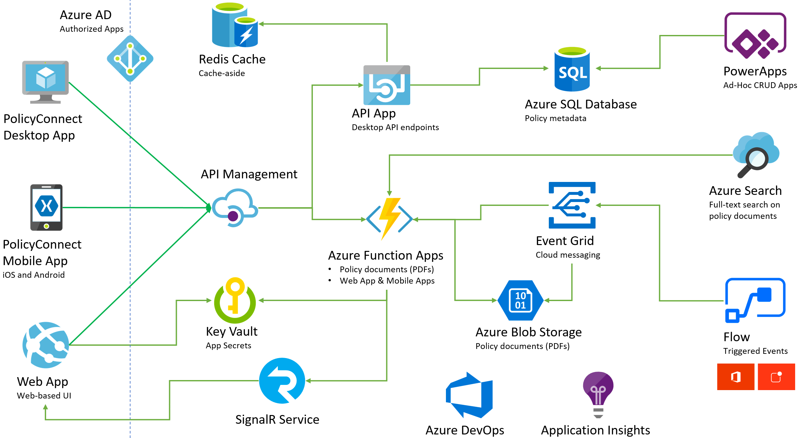

App modernization

Workshop rewrite outline

June 2019

# App modernization outline

Contoso, Ltd. (Contoso) is a new company in an old business. Founded in Auckland, NZ, in 2014, they provide a full range of long-term insurance services to help individuals who are under-insured, filling a void their founders saw in the market. From the beginning, they grew faster than anticipated and have struggled to cope with rapid growth. During their first year alone, they added over 100 new employees to keep up with the demand for their services. To manage policies and associated documentation, they use a custom developed Windows Forms application, called PolicyConnect. PolicyConnect uses an on-premises SQL Server 2008 R2 database as its data store, along with a file server on their local area network for storing policy documents. That application and its underlying processes for managing policies have become increasingly overloaded. 

To allow policyholders, brokers and employees to access policy information without requiring them to VPN into the Contoso network, they recently launched projects to create new web and mobile applications. For the web application, they have created a new .NET MVC web application, which accesses the PolicyConnect database using REST APIs. They eventually intend to have the REST APIs be shared across all of their applications, including the mobile application and WinForms version of PolicyConnect. They have a prototype of the web application running on-premises, but are interested in taking their modernization efforts a step further by hosting the application in the cloud. They have not started development of a mobile app yet, and are looking for guidance on how they can take a .NET developer-friendly approach to implement the PolicyConnect mobile app on Android and iOS.

To prepare for hosting their applications in the cloud, they would like to migrate their SQL Server database to a fully-managed SQL instance in Azure. Contoso would like to migrate their new web application to the cloud,and optimize that application to run in the cloud, including taking advantage of serverless technologies and advanced security features available in a fully-managed SQL instance in the Azure. By migrating to the cloud, they hope to improve their technological capabilities and take advantage of enhancements and services that are enabled by moving to the cloud, including adding automated document forwarding from brokers, securing access for brokers to Contoso, allowing access to policy information, and providing easy policy retrieval for a dispersed workforce. They have been clear that they will continue using the PolicyConnect WinForms application on-premises, but want to update the application to use cloud-based APIs and services. Additionally, they want to store policy documents in cloud storage for retrieval via the web and mobile applications.

## Target audience

- Application developer

## Abstract

### Workshop

In this workshop, you will gain a better understanding of the steps involved in modernizing legacy on-premises applications and infrastructure by leveraging cloud services, while adding a mix of web and mobile services, all secured using Azure Active Directory.

At the end of this workshop, you will be better able to design a modernization plan for organizations looking to move services from on-premises to the cloud.

### Whiteboard design session *(this will go in the readme and in the WDS document)*

In this whiteboard design session, you will work with a group to design a solution for modernizing legacy on-premises applications and infrastructure by leveraging cloud services, while adding a mix of web and mobile services, all secured using Azure Active Directory.

At the end of this whiteboard design session, you will be better able to design a modernization plan for organizations looking to move services from on-premises to the cloud.

### Hands-on lab *(this will go in the readme and in the HOL document)*

In this hands-on lab, you will implement the steps to modernize legacy on-premises applications and infrastructure by leveraging cloud services, while adding a mix of web and mobile services, all secured using Azure Active Directory.

At the end of this hands-on lab, you will be better able to build solutions for modernizing legacy on-premises applications and infrastructure using cloud services, and implement a mix of web and mobile services secured by Azure Active Directory.

## Azure services and related products

- Xamarin
- App Services
- PowerApps
- Flow
- Azure Storage
- Azure Search
- Azure Redis
- Azure SQL Database
- Azure Active Directory
- API Management
- Visual Studio
- Azure SQL Database Migration Service
- Azure Key Vault

## Outline: Key Concerns for Customer situation

1. They would like to migrate to a fully-managed SQL database in Azure, and take advantage of some of the key benefits that are enabled by using a PaaS database service.

   - Use DMS for migration, including using DMA for assessment and schema migration
   - Understand how to implement and take advantage of Azure SQL DB features:
     - Backups
     - Geo-replication
     - Advanced data security
       - Vulnerability assessments
       - Advanced Threat Protection
       - Data discovery and classification
     - Query performance tuning
     - Dynamic data masking (DDM)
     - Transparent data encryption (TDE)

2. Want to modernize and cloud-optimize the architecture of their .NET application, while keeping it .NET-based.
  
   _App modernization_

   - APIs:
     - Publish via APIM
     - Stay on top of API inventory and manage discoverability, security, lifecycle, and monitoring
   - WinForms app:
     - Update to use APIs hosted in Azure
     - Update database connection to Azure SQL DB instance
     - Use ExpressRoute for fast connection from on-premises
   - MVC app:
     - Replace a controller with Function App (incorporate serverless)
     - Scale Function App capability
     - Show how to take old code and start disassembling it into something more modern
       - Heart of modernization -> older app that runs better in the cloud leveraging Serverless PaaS
       - Demonstrate innovation
     - Incorporate Azure Key Vault
   - Mobile app:
     - Update to use APIs hosted in Azure

   _Cloud optimization_

   - Publish apps directly from Visual Studio
   - Deployment slots, and how to deploy to them from Visual Studio
   - High availability and auto-scaling, define server size and rules about auto-scaling
   - Backups
   - App Services IDE integration
  
3. They would like a .NET developer-friendly way to implement its PolicyConnect mobile app for Android and iOS.

   - Xamarin (reuse existing content)
   - Connect to APIs

4. They are looking for ways to empower its business users to create their own internal mobile apps that help them streamline their processes without the time and resource investment that goes into implementing full-scale mobile apps.

   - Flow and PowerApps (reuse existing content)

5. They would like to improve the management of application secrets.

   - Key Vault (use existing content)

6. They would like to make all of its policy documents full-text searchable, with the minimal amount of implementation effort.

   - Use Azure Search to implement a cognitive search pipeline (enhancement of existing content)

7. They are interested in leveraging serverless technologies to speed up API development and are interested in a POC that can be used to retrieve policy documents from storage.

   - Azure Functions + APIM (replaces existing Functions Proxy)
   - Azure Blob Storage account for policy documents

8. Contoso wants to understand how to better deploy caching in its solution, both for the purposes of lessening load on the database and for providing scalable scoreboards.

### Preferred solution

## Lab summary

### Requirements

- Azure subscription (must be MSDN or pay-as-you-go)
- Visual Studio 2019 Community Edition or higher
  - Workloads for Azure and mobile development

### Outline: Hands-on lab exercises

> Key audience is app developers, so intent is to keep the focus on areas that are specifically relevant to them.

- Before the hands-on lab                                                             (30 minutes)
  - Task 1: Provision required resources using Azure CLI, where possible
    - Resource group
    - SQL Database
    - Key Vault
    - Azure Search
    - App Services
    - APIM
    - Storage account
  - Task 2: Provision Lab VM (Visual Studio 2019 community edition image)
- Exercise 1: Migrate the database                                                    (15 minutes)
  - Task 1: Configure Azure SQL Database access
  - Task 2: Perform assessment using DMA and migrate schema
  - Task 3: Migrate data from the on-premises SQL database to Azure with DMS
- Exercise 2: Enable key Azure SQL DB features                                        (30 minutes)
  - Task 1: Enable Dynamic Data Masking
  - Task 2: Set up Data Classification and Discovery
  - Task 3: Perform and review vulnerability assessment
- Exercise 3: Configure Key Vault                                                     (5 minutes)
  - Task 1: Create a new secret to store the SQL connection string
  - Task 2: Create service principal for the web app, using Azure CLI and grant access to Key Vault
- Exercise 4: Migrate web and API apps into App Services                              (30 minutes)
  - Task 1: Deploy via Visual Studio
  - Task 2: Define server size and rules for auto-scaling
  - Task 3: Visual Studio IDE integration
  - Task 4: Configure backups
- Exercise 5: Upload policy documents into blob storage                               (10 minutes)
  - Task 1: Provision a storage account
  - Task 2: Create container for storing PDFs in Azure storage
  - Task 3: Bulk upload PDFs to blob storage using AzCopy
- Exercise 6: Create serverless API for accessing PDFs                                (15 minutes)
  - Task 1: Provision a Function App
  - Task 2: Retrieve URL for policy documents in Azure storage
  - Task 3: Create an Azure Functions Proxy
  - Task 4: Parameterize Azure Functions Proxy
- Exercise 7: Create an Azure Search service                                          (15 minutes)
  - Task 1: Configure full-text cognitive search pipeline
- Exercise 8: Import and publish APIs to APIM                                         (30 minutes)
  - Task 1: Import and publish backend APIs
- Exercise 9: Create and configure SignalR service                                    (15 minutes)
- Exercise 10: Update web app                                                          (30 minutes)
  - Task 1: Update to use Key Vault
  - Task 2: Update to use APIs
  - Task 3: Replace a controller with a Function App and APIM
  - Task 4: Add document processed workflow using SignalR service
  - Task 5: Add Application Insights
  - Task 5: Deploy updated web app to a deployment slot via VS
  - Task 6: View Live Metrics is App Insights in the Azure portal
- Exercise 11: Configure and run the Xamarin mobile app                               (15 minutes)
  - Task 1: Update to use Key Vault
  - Task 2: Update mobile app to use Azure AD
  - Task 3: Update mobile app to use new APIs through APIM
  - Task 4: Update to implement search through mobile app
- Exercise 12: Configure and run the legacy desktop (Windows Forms) application       (10 minutes)
  - Task 1: Configure application settings in App.config
  - Task 2: Run the desktop application
- Exercise 13: Create an app in PowerApps                                             (15 minutes)
  - Task 1: Sign up for a PowerApps account
  - Task 2: Create new SQL connection
  - Task 3: Create a new app
  - Task 4: Design app
  - Task 5: Edit the app settings and run the app